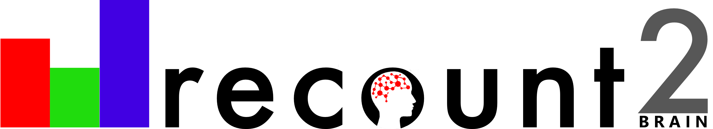
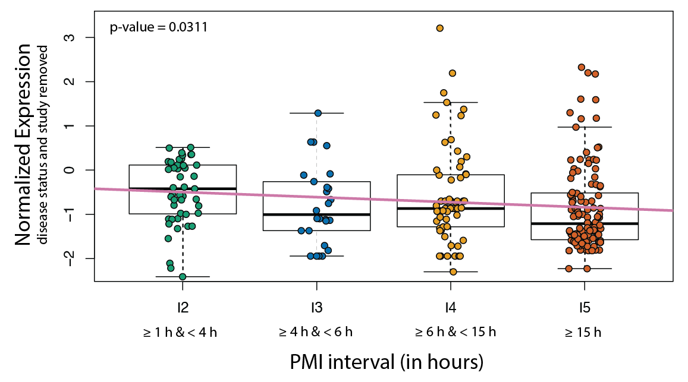

---
# PLEASE SEE THE README for in depth description github.com/brentthorne/posterdown
poster_height: "48in"
poster_width: "36in"
font_family: 'Rasa'
#ESSENTIALS
title: '**_recount-brain_: a curated repository of human brain RNA-seq datasets metadata**'
author:
  - name: Ashkaun Razmara
    affil: 1
  - name: Shannon E Ellis
    affil: 2
  - name: Dustin J Sokolowski
    affil: 3
  - name: Sean Davis
    affil: 4
  - name: Michael D Wilson
    affil: 3
  - name: Jeffrey Leek
    affil: 5
  - name: Andrew E Jaffe
    affil: 5,6
  - name: '**Leonardo Collado-Torres**'
    affil: 6,*
    main: true
    orcid: '0000-0003-2140-308X'
    twitter: fellgernon
    email: lcolladotor@gmail.com
affiliation:
  - num: 1
    address: Frank H. Netter MD School of Medicine at Quinnipiac University, North Haven, CT
  - num: 2
    address: Department of Cognitive Science Department, University of California San Diego, La Jolla, CA
  - num: 3
    address: Department of Molecular Genetics, University of Toronto
  - num: 4
    address: Center for Cancer Research, National Cancer Institute, NIH
  - num: 5
    address: Department of Biostatistics, Johns Hopkins Bloomberg School of Public Health, Baltimore
  - num: 6
    address: Lieber Institute for Brain Development, Johns Hopkins Medical Campus, Baltimore
#STYLE & FORMATTING
title_textsize: "70pt"
author_textsize: "1.17em"
authorextra_textsize: "35px"
affiliation_textsize: "25px"
affiliation_textcol: '#00000080'
caption_fontsize: "20pt"
#Middle of the poster
middle_fontfamily: "Special Elite"
middle_textcol: "#FFFFFF"
middle:textalpha: 90
middle_fontsize: "150px"
main_findings:
  - "  Analysis-ready human curated sample metadata for brain RNA-seq studies"
logoleft_name: "Figures/LIBD_logo.jpg"
logocenter_name: ""
logoright_name: "Figures/qr_imglg.png"
#---POSTER BODY OPTIONS---#
primary_colour: '#DA2536'
secondary_colour: '#FF6771'
accent_colour: "#5d19c4"
body_bgcol: "#ffffff"
body_textsize: "45px"
body_textcol: "#000000"
reference_textsize: "23px"
#--Standard Options--#
output: 
  posterdown::posterdown_betterport:
    self_contained: false
    pandoc_args: --mathjax
    highlight: espresso
    number_sections: true
    template: template.html
bibliography: MyBib.bib
---
```{r setup, include=FALSE}
knitr::opts_chunk$set(
  results = 'asis',
  echo = FALSE,
  comment = FALSE,
  warning = FALSE,
  message = FALSE,
  fig.align = 'center'
)
```

# Introduction

1. Uniformly-processed RNA-seq is available in `recount2` [@collado2017] and other projects;
2. Sample metadata from SRA is inconsistent, thus re-using this public data is challenging;
3. Metadata can be predicted from expression [@ellis2018] and mapped to ontologies [@bernstein2017].

# Methods

We identified SRA studies present in `recount2` that had at least 4 samples with at least 70% of them were predicted to correspond to the brain using `phenopredict` (v0.0.03) [@ellis2018]. Figure 6 of [@razmara2019] shows the reproducible curation workflow we followed that briefly involved: creating a list of metadata variables of interest, documenting which part of the paper/supplement the information came from, and any custom modifications. We merged `recount-brain` with GTEx and TCGA brain sample metadata and linked to controlled vocabulary terms for Brodmann region, tissue and disease.


# Results

In total, there are 6,547 samples with metadata in `recount-brain` with 5,330 (81.4%) present in recount2 from 62 SRA studies, GTEx (n=1,409) and TCGA (n=707). The curated metadata can be interactively explored through [jhubiostatistics.shinyapps.io/recount-brain/](https://jhubiostatistics.shinyapps.io/recount-brain/). Figure \@ref(fig:figure1) exemplifies some of the metadata information available for these studies.

```{r figure1, out.width='100%', fig.cap='Overview of some recount-brain sample metadata variables'}
knitr::include_graphics('Figures/Figure-1.png')
```

## Example usage

Select studies or add the sample metadata to the expression data with `recount::add_metadata()` (Figure \@ref(fig:figure2)).

```{r figure2, out.width='90%', fig.cap='Access recount-brain using the recount Bioconductor package'}
knitr::include_graphics('Figures/Figure2.png')
```


As an example of how you can use `recount-brain`, we used studies with post mortem interval (PMI) information to assess whether expression of _RNASE2_ is associated with PMI. In studies present in `recount-brain` we did find an overall association as shown in Figure \@ref(fig:figure3) in contrast to [@ferreira2018]'s findings. A sensitivity analysis releaved study variability which is why Ferreira et al likely did not observe this association.

```{r figure3, out.width='95%', fig.cap='Replicate findings from other studies using recount-brain'}

```

We used `recount-brain` to determine the consistency of gene variability across glioblastoma studies SRP027383 and SRP044668 as well as TCGA (Figure \@ref(fig:figure4)).

```{r figure4, out.width='95%', fig.cap='Assess consistency of gene variability across glioblastoma studies'}
knitr::include_graphics('Figures/Figure5.png')
```

# Conclusions

1. `recount-brain` [@razmara2019] facilitates human brain RNA-seq analyses.
2. `recount-brain` can be used for reproducing analyses, replicating findings and assessing cross-study variability.
3. Curation efforts are complementary to prediction efforts [@ellis2018] and automatic ontology mapping [@bernstein2017].
4. Our reproducible curation workflow can be adapted to curate more samples and other studies.


# References

```{r, eval = FALSE, include = TRUE, echo = FALSE}
## install.packages('BiocManager')
## BiocManager::install('recount')
recount_brain <- recount::add_metadata(
  source = 'recount_brain_v2')
```
